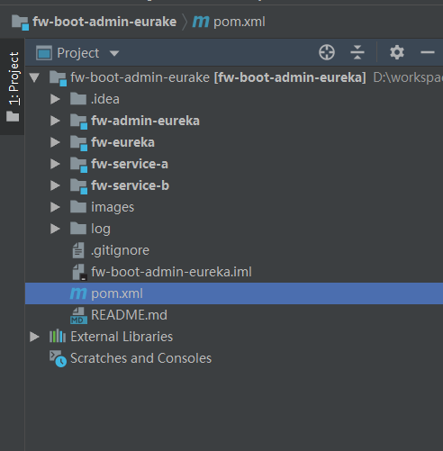
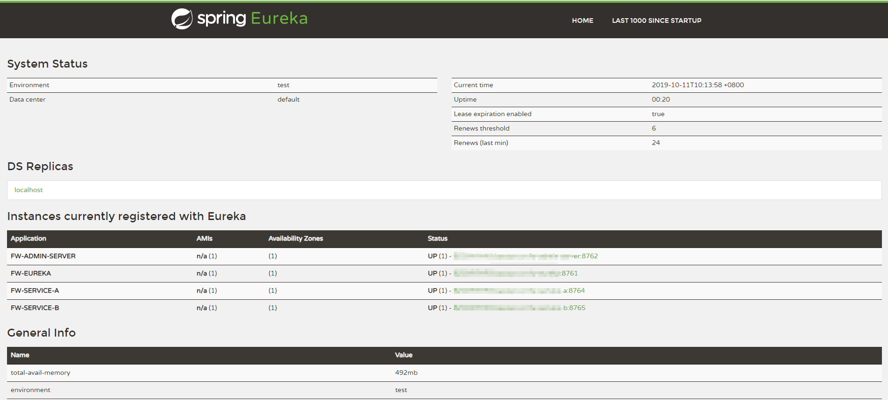
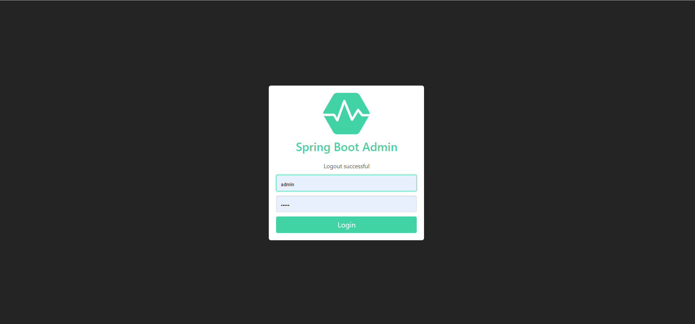
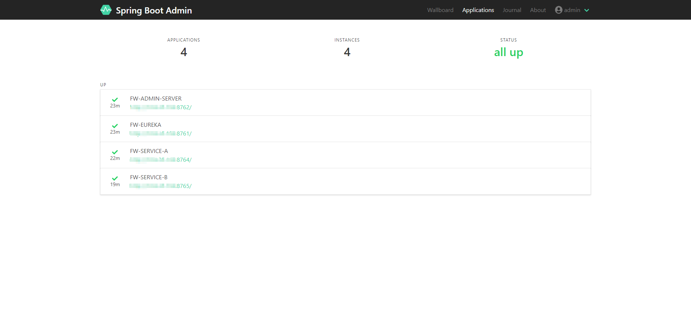
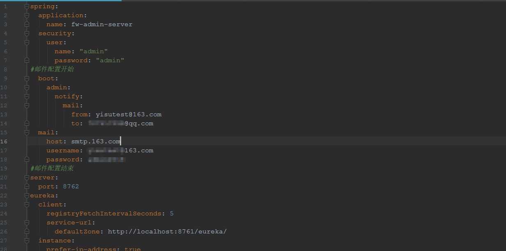
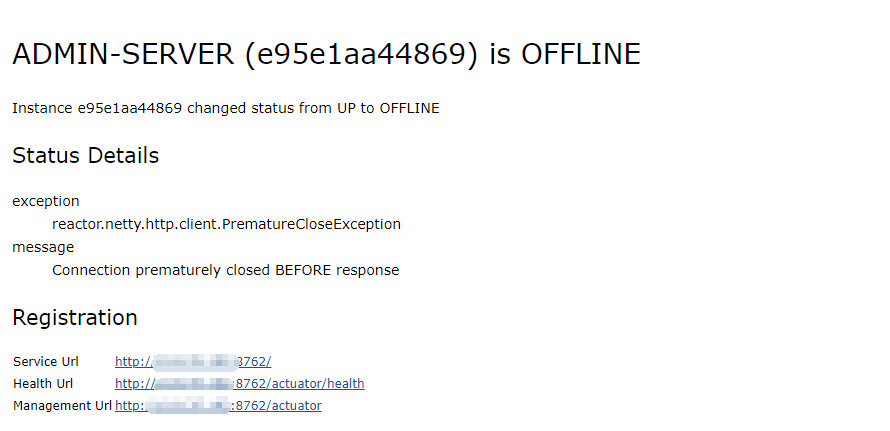

# fw-boot-admin-eureka

#### 介绍
fw-boot-admin-eureka基于 Spring Boot 2.1.6 、 eureka 、 bootadmin 、security 的监控系统demo


#### 软件架构
- fw-boot-admin-eureka 根目录
    - fw-admin-eureka admin监控server端
    - fw-eureka eureka注册中心
    - fw-service-a 服务A
    - fw-service-a 服务B
#### 安装教程
1. 先拉代码
```
git clone https://github.com/xuyisu/fw-boot-admin-eureka.git
```
2. 代码如图所示

3. 先启动fw-eureka,其它3个任意，启动完成之后，eurake信息如下,输入 `localhost:8761`

4. 浏览器输入`localhost:8762`查看监控信息 账号密码:admin admin

5. 登陆完成之后，进入监控的信息页面

#### 说明
1. fw-admin-eureka中添加了邮件的配置，主要的pom内容如下
``` pom
<dependencies>
        <dependency>
            <groupId>de.codecentric</groupId>
            <artifactId>spring-boot-admin-starter-server</artifactId>
            <version>2.1.0</version>
        </dependency>
        <dependency>
            <groupId>org.springframework.boot</groupId>
            <artifactId>spring-boot-starter-web</artifactId>
        </dependency>
        <dependency>
            <groupId>org.springframework.boot</groupId>
            <artifactId>spring-boot-starter-security</artifactId>
        </dependency>
        <dependency>
            <groupId>org.springframework.cloud</groupId>
            <artifactId>spring-cloud-starter-netflix-eureka-client</artifactId>
        </dependency>
        <dependency>
            <groupId>org.springframework.boot</groupId>
            <artifactId>spring-boot-starter-mail</artifactId>
        </dependency>

        <dependency>
            <groupId>org.springframework.security</groupId>
            <artifactId>spring-security-test</artifactId>
            <scope>test</scope>
        </dependency>

        <dependency>
            <groupId>org.jolokia</groupId>
            <artifactId>jolokia-core</artifactId>
        </dependency>
    </dependencies>
```
邮件配置可以自己申请


这样生产如果应用下线，可以收入如下邮件内容，供预警使用


#### 项目点赞
如果你用爽了，可以请作者点个start,谢谢


